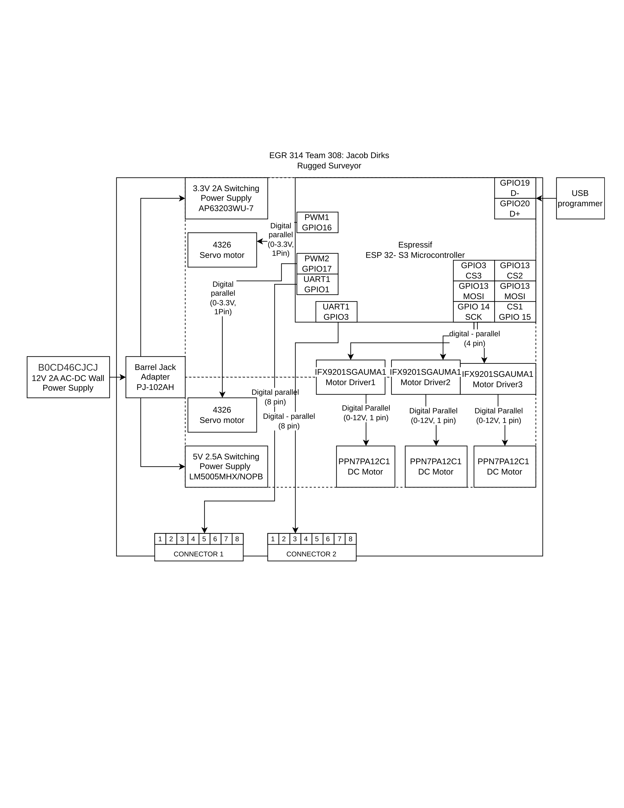

## **Overview**

For this module there are two power levels required, a 3.3V section for the micro-controller and a 12V section for the motors. This module is connected to one other module through UART which then provides direction for the motors (aka actuators) to toggle on.

## **Dirks Block Diagram**

It is also available as a ["pdf file"](resources/Dirks_EGR314_BlockDiagram.pdf) or as a ["Drawio file."](resources/Dirks_EGR314_BlockDiagram.drawio)

### **Development Procedures**

    From the start of this project our team had a general idea of the route we wanted to take the form factor of the overall exploratory device. This allows us to build our ideas into certain skill sets that each team member had or wanted to grow into. I wanted to work on my motor control and capacity to harness i2c/spi communication protocols so I knew I wanted to work on the motor subsystem. From there I started mapping out that I would need at least 2 motors, a driver, and 2 connectors for uart communication as described by the project requirements. After that I sat down and realized the ESP32 would provide me with not only a clear learning point as I hadn't experienced the module but also force me to grow with my coding skills. That's when I finally started to look at parts, selected the motor driver that we used in class to lessen the learning curve, and built two different power rails. Only at the very end did I add servo motors for increased functionality and increased application consistency.

    After the first rendition and build into a prototype a few errors were caught that were propagated from this stage and were subsequently corrected.

### **Requirements In Bullets**

* **Actuator** or sensor
* Actuator can be controlled by i2c or spi
* Actuator is bi-directional
* Utilizes **ESP32** or PIC
* **Connection upstream and downstream for UART**
* **Switching regulator**
* **Surface mount components**
* **USB** or snap programming options
