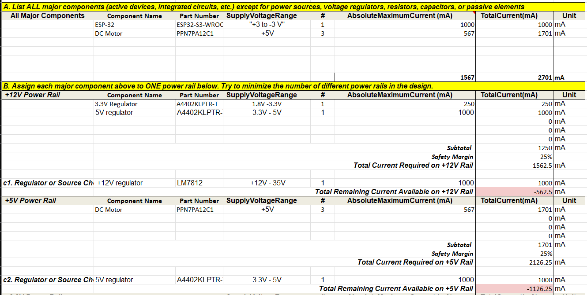
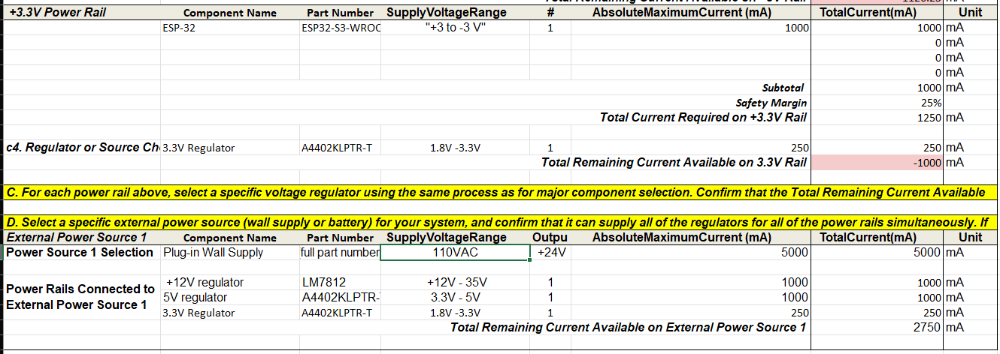

## **Overview**

Here we took the main components of our subsystem found their maximum current, placed a safety margin and then checked to see if the supply would be able to handle that. If the supply can't handle it then we will need to return to the component selection and pick a better component.

{style width:"350" height:"300;"}

{style width:"350" height:"300;"}

## **Conclusions**

From the prepared Power Budget, we will need to change the switching regulator or gather clarification on if they want true maximum current since most of the current draw would be from unused modules. We will likely need 2 or more power adapters otherwise we will not be able to safely operate this module. This model also assumes that the ESP 32 will draw the full 1A of current possible and the motor's will require their full allotment at the same time. This probability is significantly lot but it is a non zero probability and so the bounds need to be accounted for, but a lower budge would be sufficient.

## **Resources**

The power budget as a PDF download is available [*here*](DirksPowerBudget.pdf), and a Microsoft Excel Sheet [*here*](DirksPowerBudget.xlsx).
