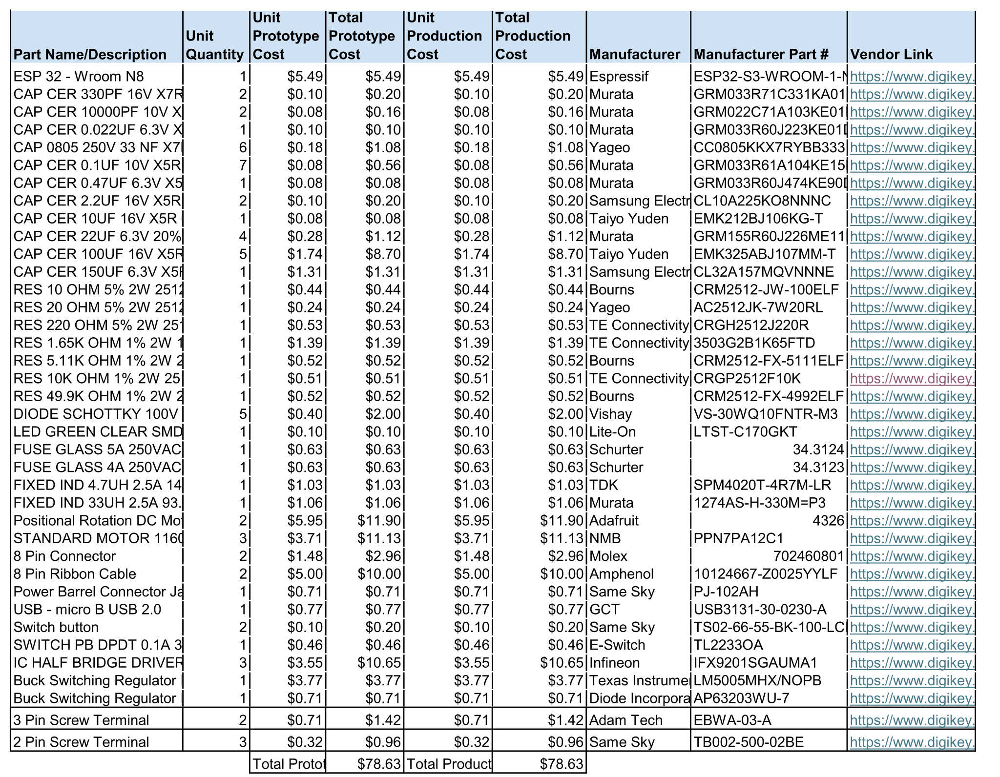
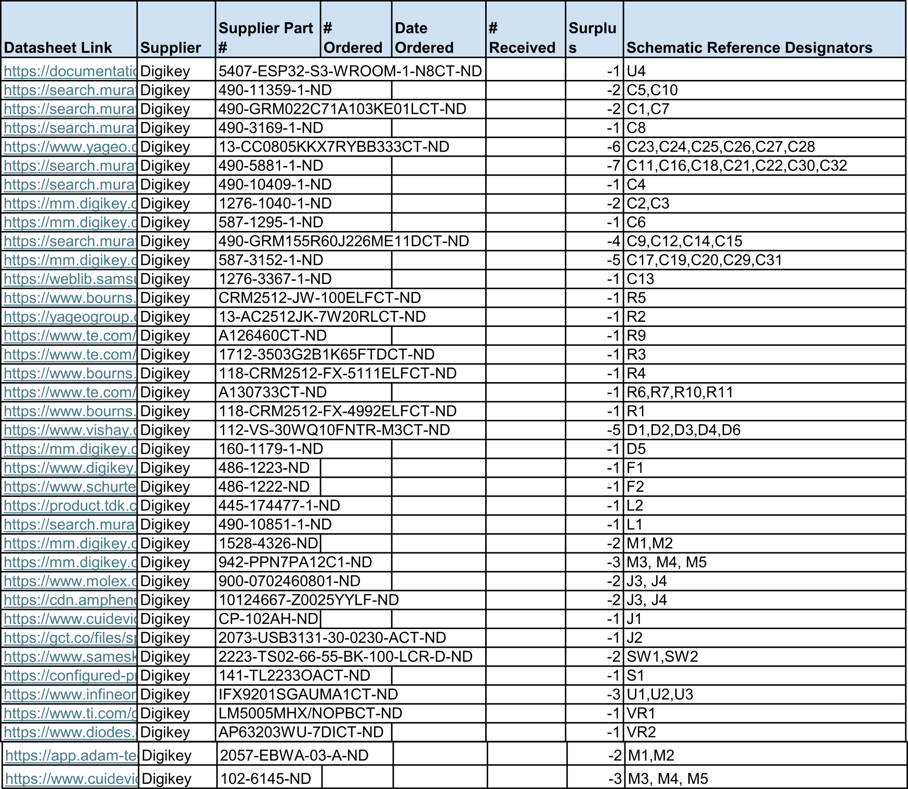

## **Overview**

For this project we had a purchasing budget of $60 for various parts, but this doesn't include taxes, tariffs, or the cost of manufacturing the pcb. Therefore, without breaking our ordering budget we are able to present the full list of components that would be required also without including: taxes, tariffs, or the cost of manufacturing the pcb. The goal of this BOM is to allow individuals the ability to recreate the project with a full understanding of the cost and parts required.

## **Bill of Materials**

{style width: "2000"}
**Figure #1:** Bill of Materials left half as a screenshot.

{style width: "2000"}
**Figure #2:** Bill of Materials right half as a screenshot.

As a note there a few more elements not on these screenshots as they would not fit.

## **Resources**

The Bill of Material is available [*as a pdf here*](DirksBOM.pdf) or as an [*Excel spreadsheet*](DirksBOM.xlsx).
