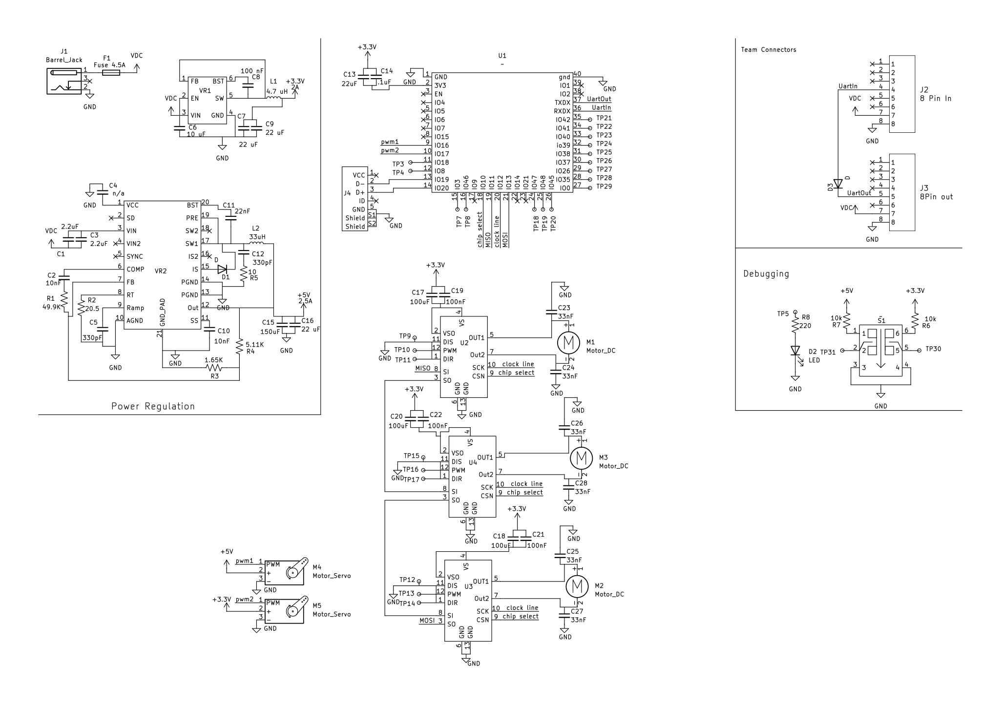

## Overview

This schematic is design to support the shared power system required by the team and act as the drive system.

{style width:"350" height:"300;"}
**Figure #1:** Showing a example schematic.

## Resouces

The schematic as a PDF download is available [*here*](JdirksSchematic.pdf), and the Zip folder of the project [*here*](Projects.zip).
