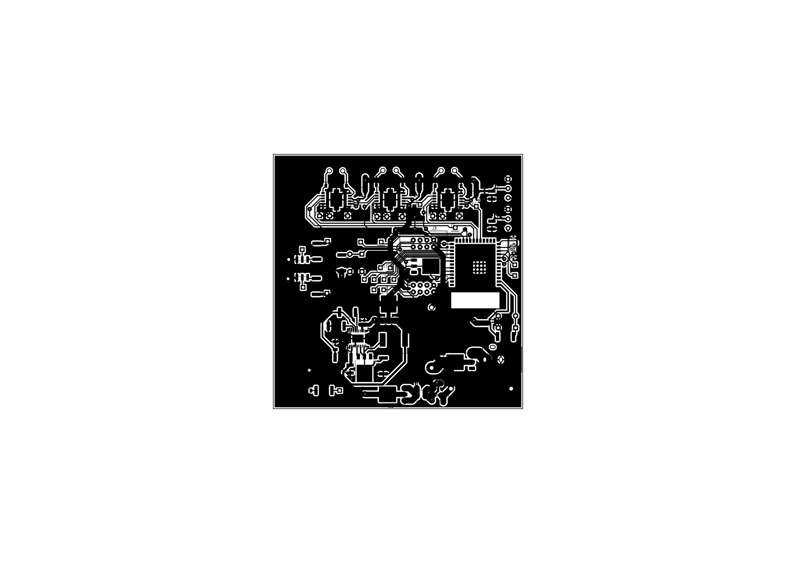
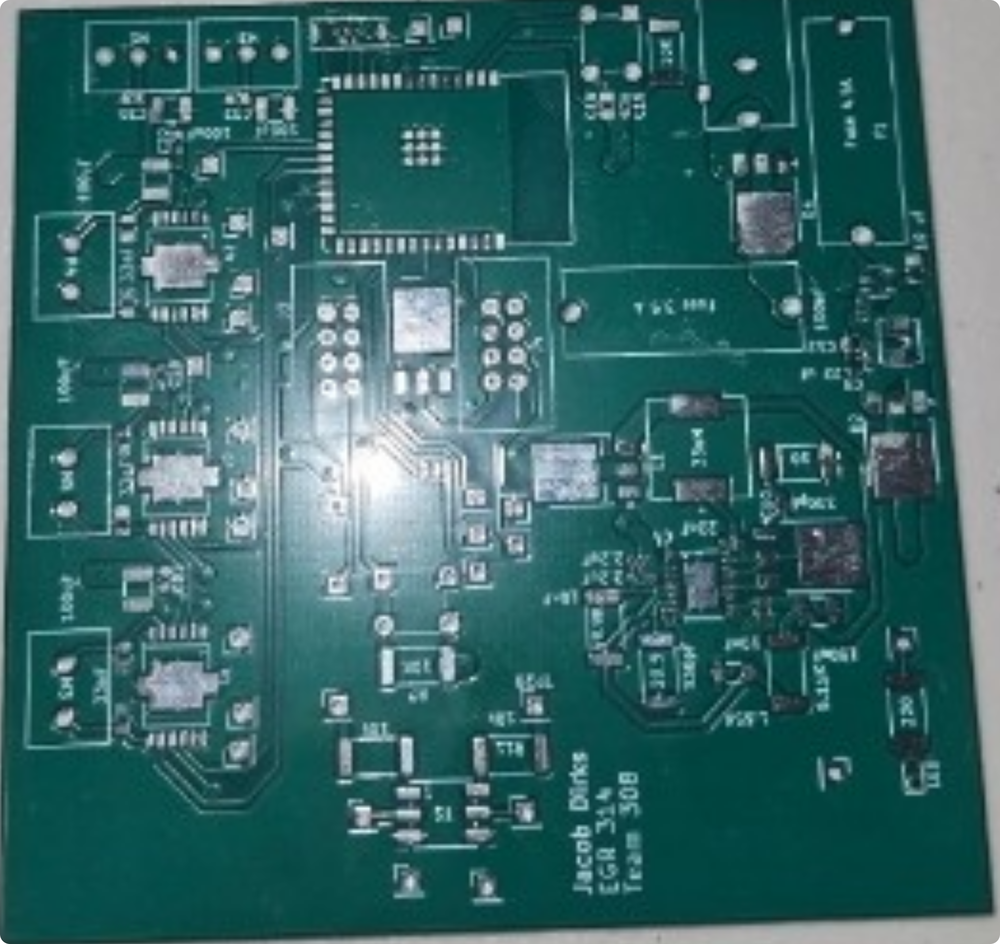
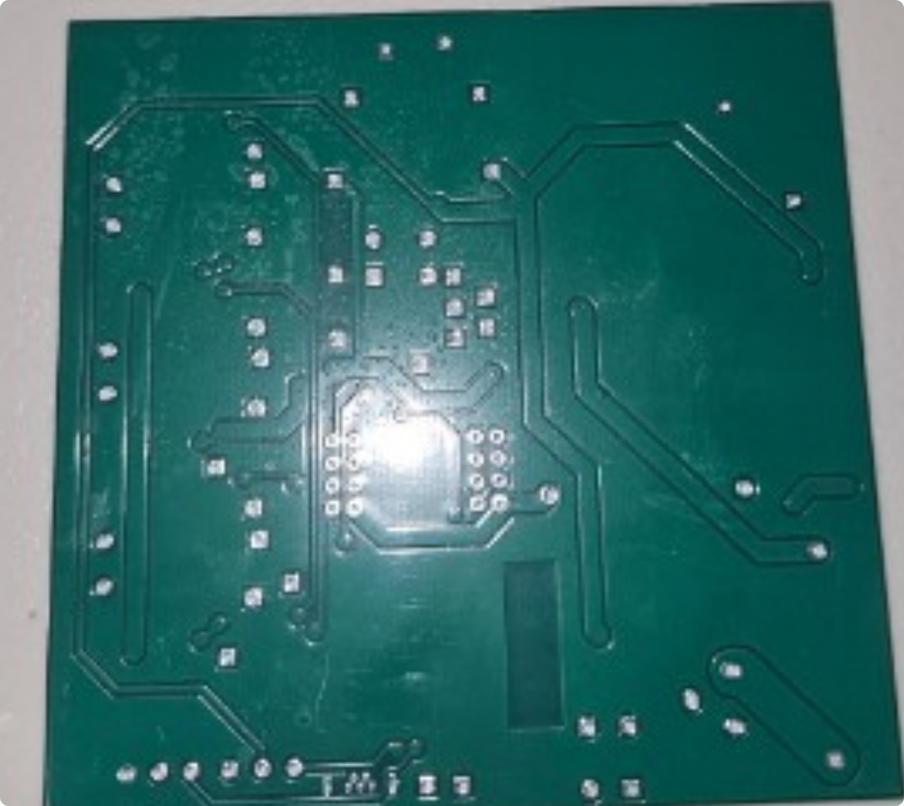
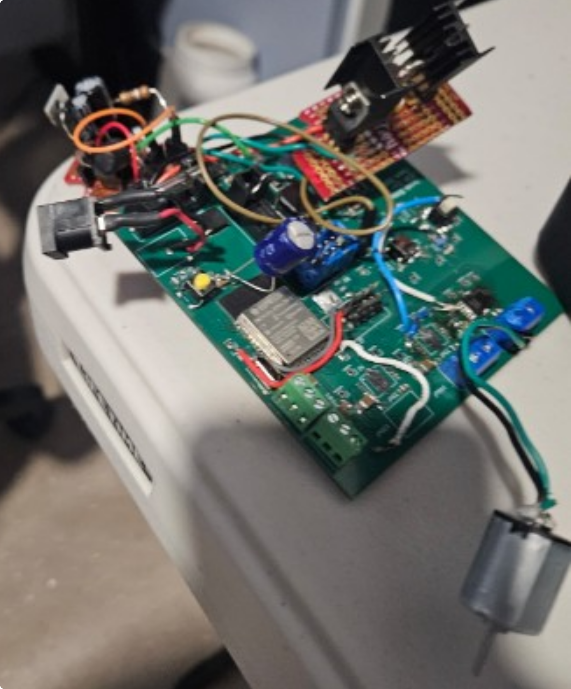
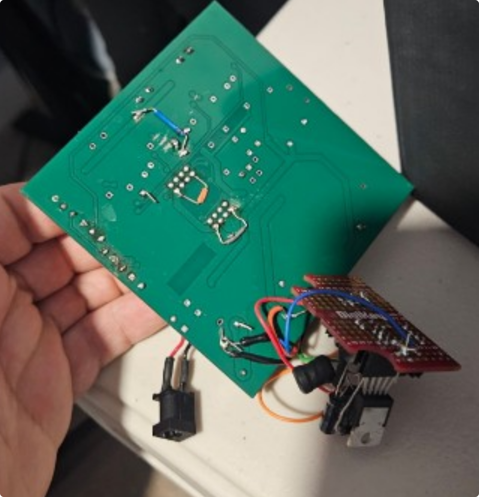

## **PCB**

This pcb is designed to not only match the schematic but also support the team's movement requirements.

{style width:"350" height:"300;"}
**Figure #1:** Showing a screenshot as rendered through KiCad of my pcb.

## **Resources**

The schematic is available [*as a pdf here*](DirksPCB.pdf), and the Zip folder of the [*project here*](Projects.zip) and the [*Gerber files*](Dirks_Gerbers.zip).

## **FinalImages**

{style width:"125" height:"150;"}
**Figure #2:** Empty top image of the PCB

{style width:"125" height:"150;"}
**Figure #3:** Empty bottom image of the PCB

{style width:"125" height:"150;"}
**Figure #4:** Populated top image of the PCB

{style width:"125" height:"150;"}
**Figure #5:** Populated bottom image of the PCB
